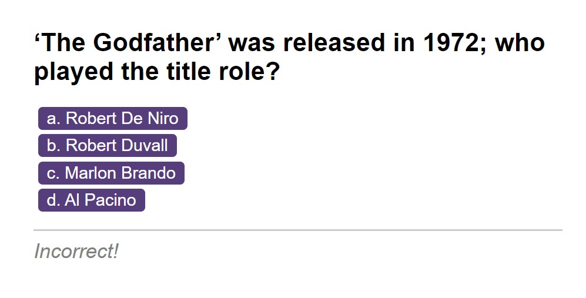

<h1>Pub Quiz</h1>

[Deployed Site](https://damianfearon.github.io/Pub-Quiz/) 
[Github Repo](https://github.com/damianfearon/Pub-Quiz) 
[HTML](https://github.com/damianfearon/Pub-Quiz/blob/main/index.html) 
[Assets](https://github.com/damianfearon/Pub-Quiz/tree/main/assets) 
[JS](https://github.com/damianfearon/Pub-Quiz/tree/main/assets/js) 
[CSS](https://github.com/damianfearon/Pub-Quiz/tree/main/assets/css) 
[SFX](https://github.com/damianfearon/Pub-Quiz/tree/main/assets/sfx) 

<h2>Module 6 Challenge: Multiple-Choice Coding Quiz </h2> 
  To help you become familiar with these tests and give you a chance to apply the skills from this module, this week’s Challenge invites you to build a timed coding quiz with multiple-choice questions. This app will run in the browser, and will feature dynamically updated HTML and CSS powered by JavaScript code that you write. It will have a clean, polished, and responsive user interface. This week’s coursework has taught you all the skills you need to succeed in this Challenge.  
 
<h2>User Story</h2>
<ul>
  AS A coding boot camp student  
  I WANT to take a timed quiz on JavaScript fundamentals that stores high scores  
  SO THAT I can gauge my progress compared to my peers </ul>  
 
<h2>Acceptance Criteria</h2>
The app should:
<ul>

<li>GIVEN I am taking a code quiz</li>

<li>WHEN I click the start button</li>

<li>THEN a timer starts and I am presented with a question</li>

<li>THEN I am presented with another question</li>

<li>WHEN I answer a question incorrectly</li>

<li>THEN time is subtracted from the clock</li>

<li>WHEN all questions are answered or the timer reaches 0</li>

<li>THEN the game is over</li>

<li>WHEN the game is over</li>

<li>THEN I can save my initials and score</li>  

</ul>
  

<h2>Grading Requirements</h2>
  

<h3>Technical Acceptance Criteria: 40%</h3>

<ul>

Satisfies all of the above acceptance criteria plus the following:

</ul>
  

<h3>Deployment: 32%</h3>

<ul>

<li>Application deployed at live URL</li>

<li>Application loads with no errors</li>

<li>Application GitHub URL submitted</li>

<li>GitHub repo contains application code</li>

</ul>
  

<h3>Application Quality: 15%</h3>

<ul>

<li>Application user experience is intuitive and easy to navigate</li>

<li>Application user interface style is clean and polished</li>

<li>Application resembles the mock-up functionality provided in the homework instructions</li>
</ul>
  

<h3>Repository Quality: 13%</h3>

<ul>

<li>Repository has a unique name</li>

<li>Repository follows best practices for file structure and naming conventions</li>

<li>Repository follows best practices for class/id naming conventions, indentation, quality comments, etc.</li>

<li>Repository contains multiple descriptive commit messages</li>

<li>Repository contains quality README file with description, screenshot, and link to deployed application</li>
</ul>
  

<h3>Screenshot</h3>
  
